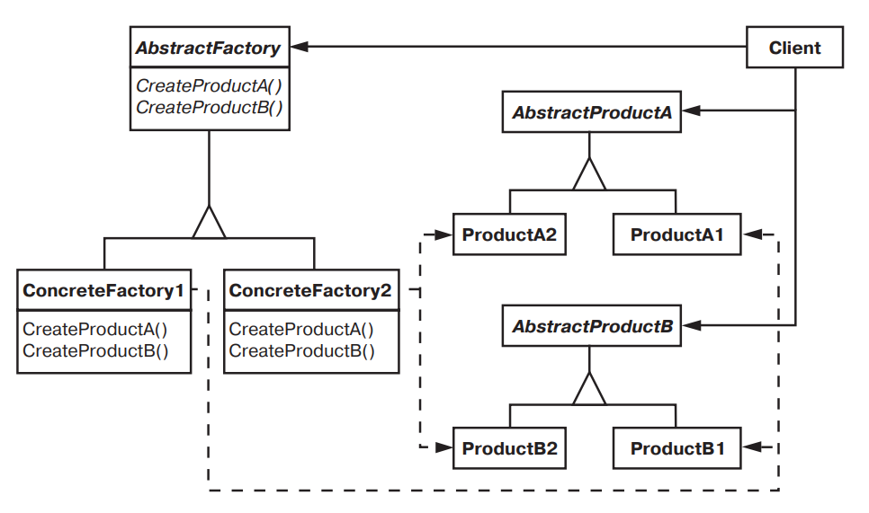

# Abstract factory (Абстрактная фабрика)

## Название и классификация паттерна

Абстрактная фабрика — паттерн, порождающий объекты.

## Назначение

Предоставляет интерфейс для создания семейств взаимосвязанных или
взаимозависимых объектов, не специфицируя их конкретных классов.

## Другие названия

Kit (инструментарий).

## Применимость

Основные условия для применения паттерна абстрактная фабрика:

- система не должна зависеть от того, как создаются, компонуются и представляются входящие в нее объекты;
- система должна настраиваться одним из семейств объектов;
- входящие в семейство взаимосвязанные объекты спроектированы для совместной работы, и вы должны обеспечить выполнение
  этого ограничения;
- вы хотите предоставить библиотеку объектов, раскрывая только их интерфейсы, но не реализацию.

## Структура

## Участники

- AbstractFactory (WidgetFactory) — абстрактная фабрика:
  - объявляет интерфейс для операций, создающих абстрактные объекты-продукты;
- ConcreteFactory (MotifWidgetFactory, PMWidgetFactory) — конкретная
  фабрика:
  - реализует операции, создающие конкретные объекты-продукты;
- AbstractProduct (Window, ScrollBar) — абстрактный продукт:
  - объявляет интерфейс для типа объекта-продукта;
- ConcreteProduct (MotifWindow, MotifScrollBar) — конкретный продукт:
  - определяет объект-продукт, создаваемый соответствующей конкретной фабрикой;
  - реализует интерфейс AbstractProduct;
- Client — клиент:
  - пользуется исключительно интерфейсами, которые объявлены в классах AbstractFactory и AbstractProduct.

## Отношения

- Обычно во время выполнения создается единственный экземпляр класса ConcreteFactory. Эта конкретная фабрика создает
  объекты-продукты, имеющие вполне определенную реализацию. Для создания других
  видов объектов клиент должен воспользоваться другой конкретной фабрикой;
- AbstractFactory передоверяет создание объектов-продуктов своему подклассу ConcreteFactory.

## Результаты

Паттерн абстрактная фабрика:

- Изолирует конкретные классы.
  - Паттерн помогает контролировать классы объектов, создаваемых приложением. Поскольку фабрика инкапсулирует
    ответственность за создание классов и сам процесс их создания, то она изолирует клиента от подробностей реализации
    классов. Клиенты манипулируют экземплярами через их абстрактные интерфейсы. Имена изготавливаемых классов известны
    только конкретной фабрике, в коде клиента они не упоминаются;
- Упрощает замену семейств продуктов.
  - Класс конкретной фабрики появляется в приложении только один раз: при создании экземпляра. Это облегчает замену
    используемой приложением конкретной фабрики. Приложение может изменить конфигурацию продуктов, просто подставив
    новую конкретную фабрику. Поскольку абстрактная фабрика создает все семейство продуктов, то и заменяется сразу все
    семейство. В нашем примере для переключения пользовательского интерфейса с виджетов Motif на виджеты Presentation
    Manager достаточно переключиться на продукты соответствующей фабрики и заново создать интерфейс;
- Гарантирует сочетаемость продуктов.
  - Если продукты некоторого семейства спроектированы для совместного использования, то важно, чтобы приложение в каждый
    момент времени работало только с продуктами единственного семейства. Класс AbstractFactory позволяет легко соблюсти
    это ограничение;
- Не упрощает задачу поддержки нового вида продуктов.
  - Расширение абстрактной фабрики для изготовления новых видов продуктов — непростая задача. Дело в том, что интерфейс
    AbstractFactory фиксирует набор продуктов, которые можно создать. Для поддержки новых продуктов необходимо расширить
    интерфейс фабрики, то есть изменить класс AbstractFactory и все его подклассы.
