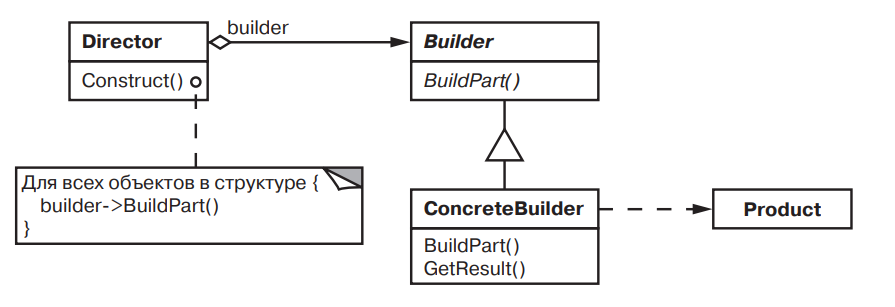

# Builder (Строитель)

## Название и классификация паттерна

Строитель — паттерн, порождающий объекты.

## Назначение

Отделяет конструирование сложного объекта от его представления, так что
в результате одного и того же процесса конструирования могут получаться
разные представления.

## Применимость

Основные условия для применения паттерна строитель:

- алгоритм создания сложного объекта не должен зависеть от того, из каких частей состоит объект и как они стыкуются
  между собой;
- процесс конструирования должен обеспечивать различные представления конструируемого объекта.

## Структура

## Участники

- Builder (MazeBuilder) — строитель:
    - задает абстрактный интерфейс для создания частей объекта Product;
- СoncreteBuilder (StandardMazeBuilder, CountingMazeBuilder) — конкретный строитель:
    - конструирует и собирает вместе части продукта посредством реализации интерфейса Builder;
    - определяет создаваемое представление и следит за ним;
    - предоставляет интерфейс для доступа к продукту (например, GetMaze);
- Director (MazeGame) — распорядитель:
    - конструирует объект, пользуясь интерфейсом Builder;
- Product (Maze) — продукт:
    - представляет сложный конструируемый объект. ConcreteBuilder строит внутреннее представление продукта иопределяет
      процесс его сборки;
    - включает классы, которые определяют составные части, в том числе интерфейсы для сборки конечного результата из
      частей.

## Отношения

- клиент создает объект-распорядитель Director и настраивает его нужным объектом-строителем Builder;
- распорядитель уведомляет строителя о том, что нужно построить очередную часть продукта;
- строитель обрабатывает запросы распорядителя и добавляет новые части к продукту;
- клиент забирает продукт у строителя.

## Результаты

Паттерн строитель:

- _позволяет изменять внутреннее представление продукта_. Объект Builder предоставляет распорядителю абстрактный интерфейс
  для конструирования продукта, за которым он может скрыть представление и внутреннюю структуру продукта, а также
  процесс его сборки. Поскольку продукт конструируется через абстрактный интерфейс, то для изменения внутреннего
  представления достаточно всего лишь определить новый вид строителя;
- _изолирует код, реализующий конструирование и представление_. Паттерн строитель улучшает модульность, инкапсулируя
  способ конструирования и представления сложного объекта. Клиентам ничего не надо знать о классах, определяющих
  внутреннюю структуру продукта; эти классы не входят в интерфейс строителя.
- _предоставляет более точный контроль над процессом конструирования_. В отличие от порождающих паттернов, которые сразу
  конструируют весь объект целиком, строитель делает это шаг за шагом под управлением распорядителя. И лишь когда
  продукт завершен, распорядитель забирает его у строителя. Поэтому интерфейс строителя в большей степени отражает
  процесс конструирования продукта, нежели другие порождающие паттерны. Это позволяет обеспечить более тонкий контроль
  над процессом конструирования, а значит, и над внутренней структурой готового продукта.